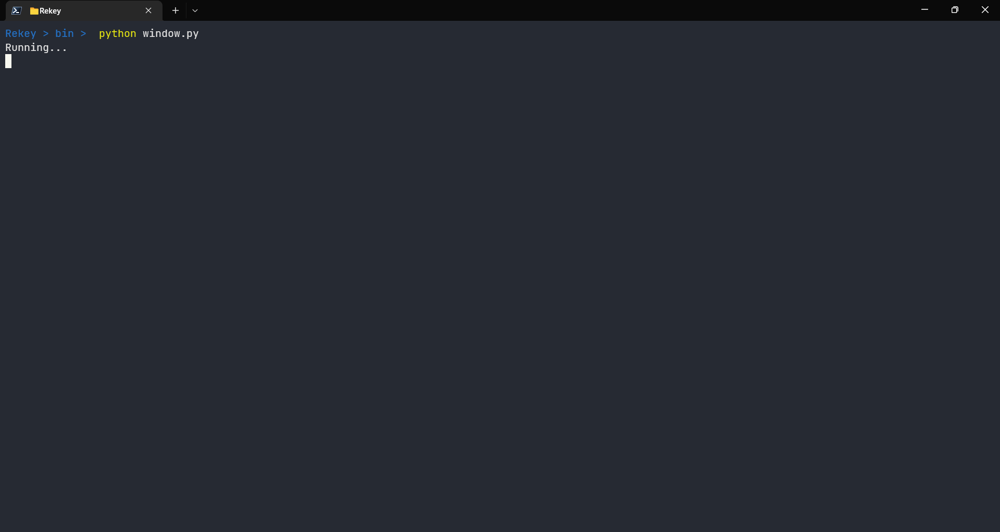
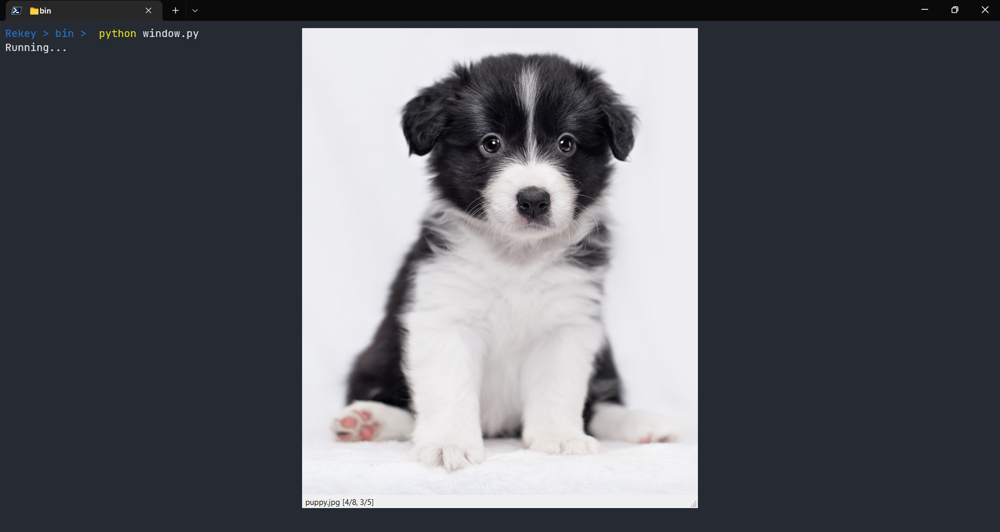
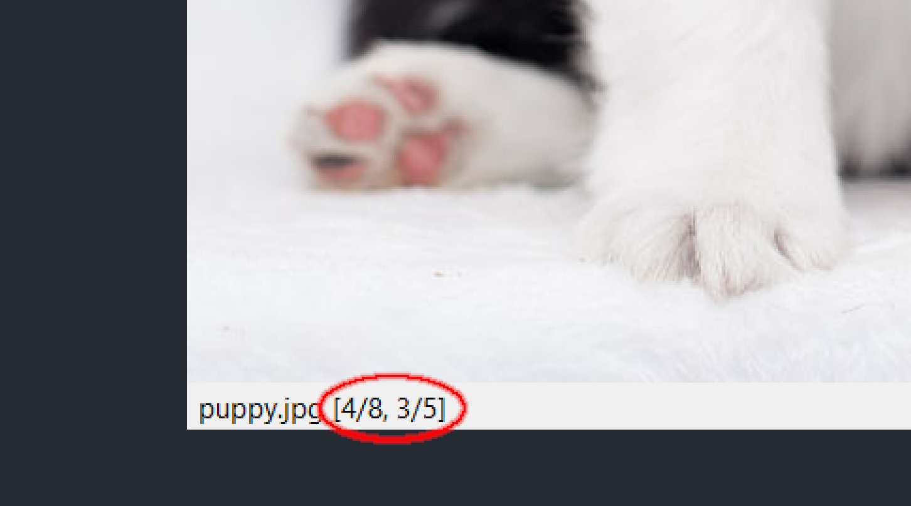
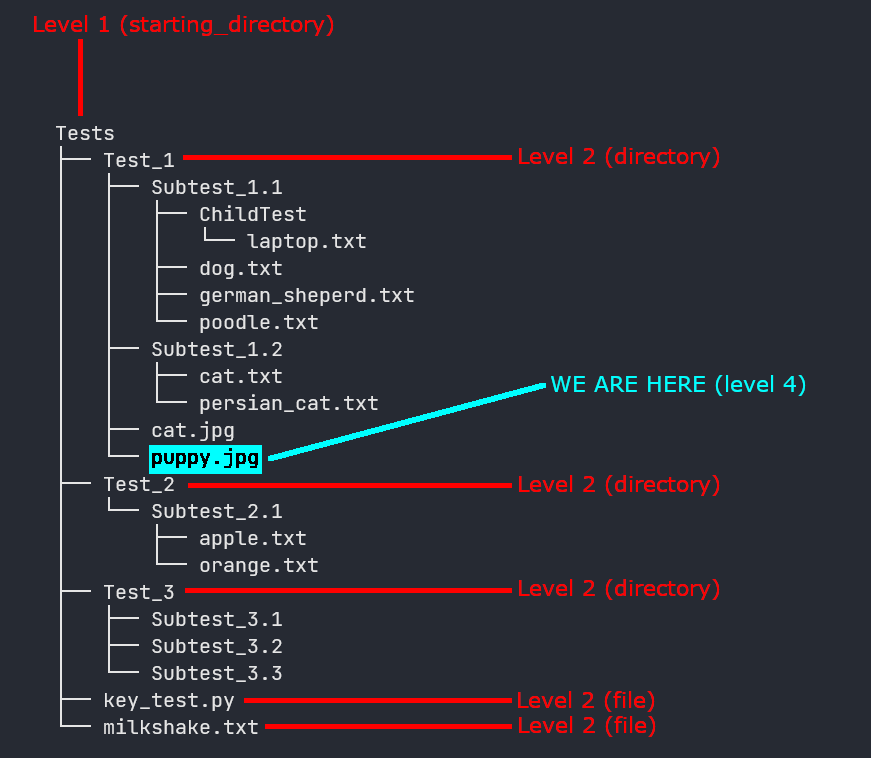
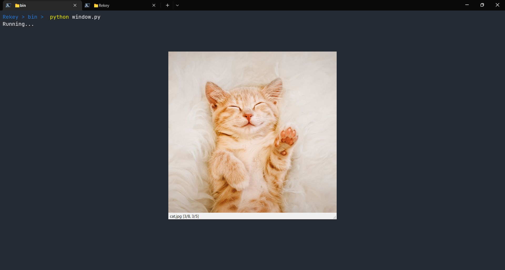

# Rekey

# Introduction

I always wished I could have an image reference tool so I could quickly refer to them without disturbing my workflow. Then this wish grew from a want to a need. Hence I developed this tool written using Python, where I can reference any number of images I want without leaving my keyboard or having to use my mouse.
Hence I developed this tool written using Python, where I can reference any number of images I want without leaving my keyboard or having to use my mouse.

Using Rekey you can invoke a window and navigate through the directory which contains your reference images, all by using only keybindings!
And everything, from window position and height to keybindings is configurable in the config file


# Features

Rekey is a productivity tool using which you can navigate through a directory/folder and view image files present in them, using keybindings. Using Rekey you can refer to:

- Cheat sheets

- Keybindings

- Notes

- Images

- Charts and graphs

And more by using just your keyboard! Your imagination is the limit when it comes to Rekey


# Installation

- Prerequisites

	[Python 3](https://www.python.org/) is required to run this project

	Once you have Python 3 installed, continue with Step 1:

- Step 1:
	Open your favourite terminal and run:

	```
	git clone https://github.com/pranavpa8788/Rekey.git
	```

	Or you can download the zip file and extract it to your desired location

- Step 2:

	Now cd into the directory Rekey, and then into bin

	```
	cd Rekey
	cd bin
	```

- Step 3:

	Run:

	```
	pip install -r requirements.txt
	```

	And this will install the required dependency modules
	If the above fails, you can manually install the following modules

	* [PyQt5](https://pypi.org/project/PyQt5/)

	```
	pip install PyQt5
	```

	* [Pillow](https://pypi.org/project/Pillow/)

	```
	pip install Pillow
	```

	* [pynput](https://pypi.org/project/pynput/)

	```
	pip install pynput
	```

- Step 4:

	Run:

	```
	python window.py
	```

	and this should start the process, now if you haven't changed the config file,
	Ctrl + Shift + R should spawn the window and
	Ctrl + Shift + Q should close it

- Step 5:

	Now you can add the file to PATH to run it from anywhere

# Configuration

You can configure various parameters using the Rekey/bin/config.json file (which initially contains default values), including keybindings. Once you modify the config file, you must relaunch the program, make sure to quit first (key_window_exit; Ctrl Shift Q by default)
Parameters in json are in {key: value} pairs, where each pair is separated by a comma

- `window_position_x`, `window_position_y`

	- Key: window_position_x

		Value: n% string (where n is an integer within range 0%-100%)

		Description: Window's x coordinate

	- Key: window_position_y

		Value: n% string (where n is an integer within range 0%-100%)

		Description: Window's y coordinate

	- Example:

	| window\_position\_x, window\_position\_y | Window position |
	| :---: | :---: |
	| "0%", "0%" | Top left |
	| "100%", "0%" | Top right |
	| "0%", "100%" | Bottom left |
	| "100%", "100%" | Bottom right	|
	| "50%", "50%" | Middle |

	In this manner you can specify any percentage as long as its between 0 and 100

- `window_width`, `window_height`

	- Key: window_width

		Value: n% string (where n is an integer within range 0%-100%)

		Description: Window's x coordinate


	- Key: window_height

		Value: n% string (where n is an integer within range 0%-100%)

		Description: Window's y coordinate


	- Example:

		`window_width`: "50%"

		`window_height`: "50%"

- `window_borderless`
	- Key: window_borderless

		Value: true/false

		Description: When set to true, the window is borderless

		Example: `window_borderless`: true

- `window_stay_on_top`
	- Key: window_stay_on_top

		Value: true/false

		Description: When set to true the window spawns on top of active windows

		Example: `window_stay_on_top`: true

- `fit_to_image`
	- Key: fit_to_image

		Value: true/false

		Description: When set to true the window dimensions change according to the image dimensions

		Note: When set to false, larger images can get clipped (Zoom in/out feature coming soon)

		Example: `fit_to_image`: true

- `image_margin`
	- Key: image_margin

		Value: n (where n is an integer ≥ 0)

		Description: Specifies the margin between image border and window edge

		Example: `image_margin`: 10

- `background_color`
	- Key: background_color

		Value: #hhhhhh string (where #hhhhhh is a hexadecimal number specifying the color value)

		Description: Specifies the background color of the window

		Example:

		`background_color`: "#000000" is black

		`background_color`: "#ffffff" is white

- `starting_directory`
	- Key: starting_directory

		Value: directory string (make sure to use \\ when specifying paths on windows)

		Description: You can either specify the relative path, or the full path which will be set as the root/parent node

		Example: There is a Tests folder inside bin/ you can either set

		`starting_directory`: "Tests" or

		`starting_directory`: "path/to/Tests"

- `starting_node`
	- Key: starting_node

		Value: directory string (make sure to use \\ when specifying paths on windows)

		Description: Specifies the starting node which the window spawns with (default is the starting_directory), like above you can specify either the full path or just the file/dir name

		Example:

		`starting_node`: puppy.jpg or

		`starting_node`: "Tests/Test_1/puppy.jpg"

- `key_window_toggle`
	- Key: key_window_toggle

		Value: key sequence string

		Description: Keybinding for toggle the window to hide/show

		Example: `key_window_toggle`: "\<ctrl\>+\<alt\>+r"

- `key_window_exit`
	- Key: key_window_exit

		Value: key sequence string

		Description: Keybinding for exiting the program (This will completely close the program)

		Example: `key_window_exit`: "\<ctrl\>+\<alt\>+q"

- `key_up`, `key_down`, `key_left`, `key_right`
	- Key: key_up, key_down, key_left, key_right

		Value: key sequence string

		Description: Keybindings for the directional keys to navigate through directory

		Example:

		`key_up`: "\<ctrl\> + W",

		`key_down`: "\<ctrl\> + S",

		`key_left`: "\<ctrl\> + A",

		`key_right`: "\<ctrl\> + D",

Note: Some keys like arrow keys won't work, and will be fixed in the next update

# Usage

Consider the default configuration file. We can start the program by running the python command



Then pressing Ctrl + Shift + R spawns the window



Now if we observe closely, you should see two numbers [4/8, 3/5]. Here 4 is the position of our current file out of total files in that level(8). Similarly 3 is the 3rd level out of total number of levels(5).



This can be better visualized by looking at the tree view of the parent/root directory contents



Now if you press the left/right keys you will move towards left or right in that level (level 4 right now). So pressing left will change our current position from 4 to 3 and we will be viewing cat.jpg. And pressing right will change our current position from 4 to 5 and we will be viewing Subtest_2.1 (Notice that we can move across directories without having to change the current level)

Now pressing Ctrl + h (default keybinding for key_left) shows me cat.jpg



Pressing Ctrl + Shift + R again will hide the window (not the program, so you can spawn again by pressing Ctrl + Shift + R. Press Ctrl + Shift + Q to exit)

Below is a video showing the entire process (alongwith keybindings shown at bottom right)


<!---->

# Issues
Feel free to report any issues you might experience, just make sure to once read the [issues page](https://github.com/pranavpa8788/Rekey/blob/main/docs/issues.md) and [upcoming features page](https://github.com/pranavpa8788/Rekey/blob/main/docs/more_info.md) which contains known bugs, upcoming features and the format for reporting issues

# Contributing

Contributions are welcome with open arms! Head over to [contribution guide](https://github.com/pranavpa8788/Rekey/blob/main/docs/contributing.md) to get started

# Read more

If you want to read more about this project, such as how it works or the philosophy behind this project, and more. Head over to

[How it works](https://github.com/pranavpa8788/Rekey/blob/main/docs/how_it_works.md)

[Philosophy, upcoming features and more](https://github.com/pranavpa8788/Rekey/blob/main/docs/more_info.md)

# Credits
This project credits the following python libraries which were used:

* [PyQt5](https://pypi.org/project/PyQt5/)
* [Pillow](https://pypi.org/project/Pillow/)
* [pynput](https://pypi.org/project/pynput/)

# Uninstall
To remove the python libraries, run:

`pip uninstall -r requirements.txt`

Or manually, run:

`pip install PyQt5`

`pip install Pillow`

`pip install pynput`
